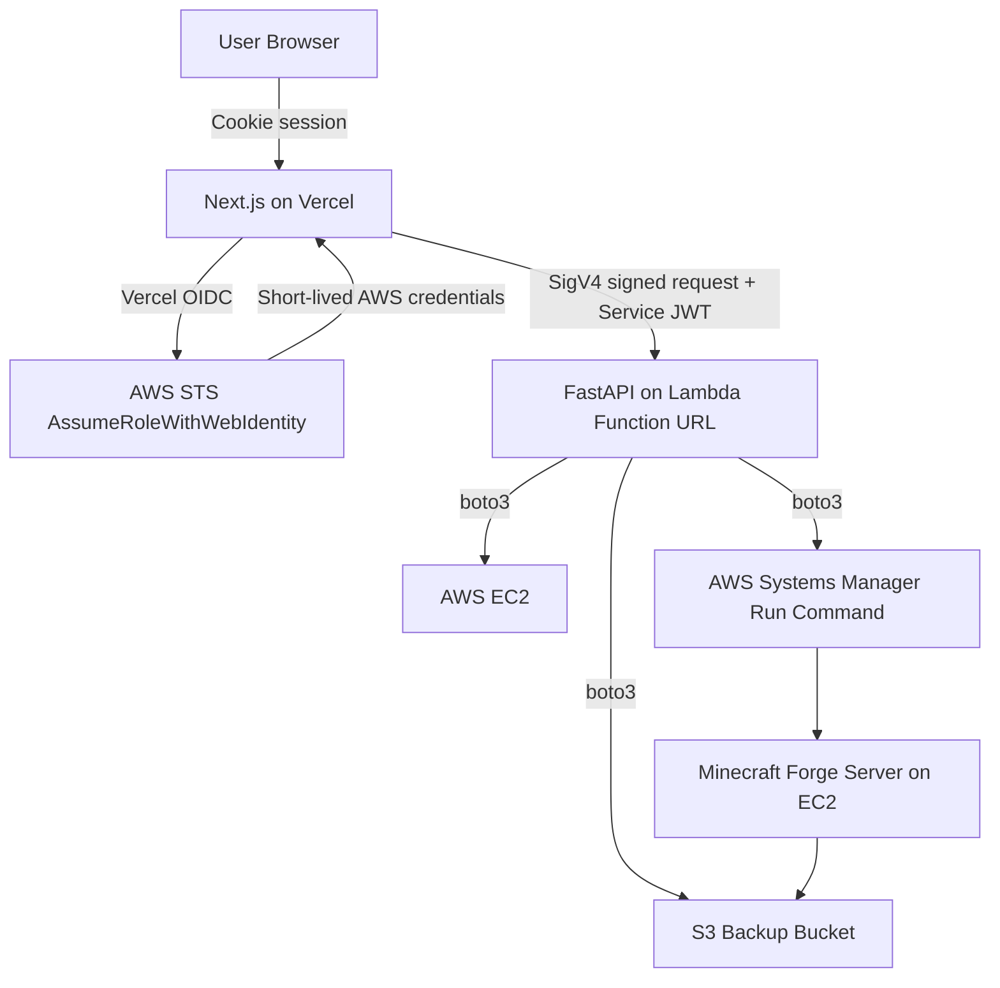

# システム構成・技術選定

## 採用技術

| 領域 | 採用 |
|---|---|
| Frontend | Next.js |
| UI | Chakra UI |
| Auth | Better Auth Stateless Session |
| Backend | FastAPI |
| Backend runtime | AWS Lambda |
| Backend HTTP endpoint | Lambda Function URL |
| AWS認証 | Vercel OIDC Federation |
| Minecraft server | EC2 |
| Command execution | AWS Systems Manager Run Command |
| Backup | S3 |
| IaC | Terraform |
| DB | MVPではなし、v1でDynamoDB |

## 全体構成



## 通信経路

### Browser → Next.js

- Better AuthのセッションCookieで認証する。
- UIから直接FastAPI Backendを呼ばない。
- UIはNext.js BFF API Routesを呼ぶ。

### Next.js BFF → FastAPI Backend

- Vercel OIDC FederationでAWSの短期credentialを取得する。
- Lambda Function URLに対してSigV4署名付きリクエストを送る。
- 追加で `X-MCSM-JWT` に短命Service JWTを付与する。

### FastAPI Backend → AWS

- Lambda実行RoleでAWS APIを呼ぶ。
- EC2起動、EC2状態取得、SSM Run Command送信を行う。
- EC2/S3操作の権限はLambda側に閉じる。

## なぜFastAPIか

- OpenAPI自動生成との相性が良い
- orval等によるAPIクライアント生成に繋げやすい
- AWS SDK for Python（boto3）を使いやすい
- 小規模APIとして実装量を抑えやすい

## なぜLambda Function URLか

- ALBやAPI GatewayよりMVP構成が小さい
- 常時起動コンテナが不要
- コストを抑えやすい
- `AWS_IAM` 認証を使って呼び出し元を制限できる

ただし、Lambda Function URLはネットワーク的に完全なprivate endpointではない。MVPでは `AWS_IAM` + Service JWT + 最小権限IAMで防御する。

## なぜECS/Fargate + internal ALBを使わないか

- MCSMの規模に対して常時稼働コストが高い
- ALBだけでも月額1000円目標を超えやすい
- Private backendとしては綺麗だがMVPには過剰
- 運用対象が増える

## DBなしMVPの方針

MVPではDBを持たない。サーバー定義はBackendの環境変数または設定ファイルで管理する。

```json
[
  {
    "id": "vanilla-1",
    "name": "Vanilla-1.12.0-CutAll",
    "instanceId": "i-xxxxxxxxxxxxxxxxx",
    "region": "ap-northeast-1",
    "minecraftVersion": "1.12.0"
  }
]
```

AWS APIから取得する情報:

- EC2 state
- Public IP
- LaunchTime

DBなしで困る情報:

- 誰が起動/停止したか
- 正確な停止時刻
- STOPPING中の全ユーザー共有状態
- SSM commandIdや失敗履歴

これらはv1でDynamoDBを導入して解決する。
