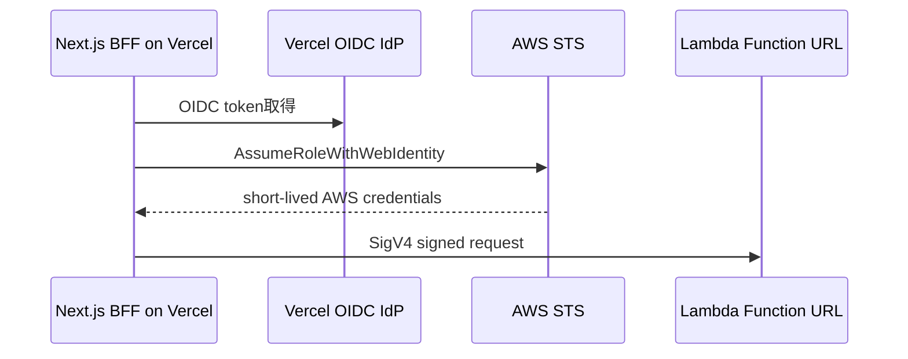

# 認証・認可・サービス間認証・Secret管理

## 基本方針

MVPでは、利用者が少数であるため、複雑なロール管理は行わない。代わりに、許可済みメールアドレスのみがログインできるようにする。

## ユーザー認証

- Better Auth Stateless Session
- Google OAuth
- GitHub OAuth
- メール&パスワード認証は使わない

### メール&パスワード認証を使わない理由

- パスワードハッシュ保存が必要になる
- パスワードリセット機能が必要になる
- メール送信基盤が必要になる
- 少人数利用ではOAuth + allowlistの方がシンプル

## 許可済みメールアドレス

公開リポジトリにメールアドレスをコミットしない。以下のような環境変数で管理する。

```env
MCSM_ALLOWED_EMAILS="you@example.com,friend1@example.com,friend2@example.com"
```

Next.js BFFでセッション確認後にallowlistチェックを行う。

```ts
const allowedEmails = process.env.MCSM_ALLOWED_EMAILS?.split(",") ?? []

if (!session.user.email || !allowedEmails.includes(session.user.email)) {
  throw new Error("Forbidden")
}
```

MVPではロール管理は行わない。全利用者が一覧表示、起動、停止を行える。

## BFF → Backendのサービス間認証

BFFからBackendへは2段階で防御する。

1. AWS_IAM: Lambda Function URL呼び出し権限を検証
2. Service JWT: BFFが認証済みユーザー情報をBackendへ渡す

### リクエスト例

SigV4署名が `Authorization` ヘッダーを使うため、Service JWTは独自ヘッダーで渡す。

```http
GET /servers
X-MCSM-JWT: <service-jwt>
```

### Service JWT payload

```json
{
  "sub": "user-id",
  "email": "user@example.com",
  "iss": "mcsm-bff",
  "aud": "mcsm-backend",
  "iat": 1234567890,
  "exp": 1234568190
}
```

### Backendで検証すること

- 署名
- `exp`
- `iss`
- `aud`

MVPではBackend側でロール判定は行わない。

## Vercel OIDC Federation

Vercelに長期AWSアクセスキーを置かず、Vercel OIDC FederationでAWS STSから短期credentialを取得する。



## IAM方針

### VercelがAssumeするAWS Role

許可する操作をLambda呼び出しのみに限定する。

```json
{
  "Effect": "Allow",
  "Action": [
    "lambda:InvokeFunctionUrl",
    "lambda:InvokeFunction"
  ],
  "Resource": "arn:aws:lambda:ap-northeast-1:123456789012:function:mcsm-backend"
}
```

### Lambda実行Role

Backend Lambdaに付与する権限。

- `ec2:DescribeInstances`
- `ec2:StartInstances`
- `ssm:SendCommand`
- `ssm:GetCommandInvocation`

MVPでは停止処理をEC2内 `shutdown -h now` に任せるため、`ec2:StopInstances` は必須ではない。

### EC2 Instance Role

- `AmazonSSMManagedInstanceCore`
- バックアップ用S3 bucket/prefixへの `s3:PutObject`
- 必要に応じて `s3:ListBucket`

## Secret管理

### Vercel側

- `BETTER_AUTH_SECRET`
- OAuth client secret
- Service JWT private key
- `MCSM_ALLOWED_EMAILS`

### AWS Lambda側

- Service JWT public key
- `MCSM_JWT_ISSUER`
- `MCSM_JWT_AUDIENCE`
- `MCSM_SERVERS_JSON`

MVPではLambda環境変数でもよいが、v1以降はSecrets ManagerまたはSSM Parameter Storeへの移行を検討する。

## セキュリティ注意点

- Vercelに長期AWSアクセスキーを置かない
- Lambda Function URLは `AWS_IAM` にする
- Service JWTは短命にする
- BackendにはAWS操作権限を最小限だけ付与する
- RCONポートはインターネットへ開けない
- SSHは常時開放しない
- EC2操作はSSM経由を基本にする
