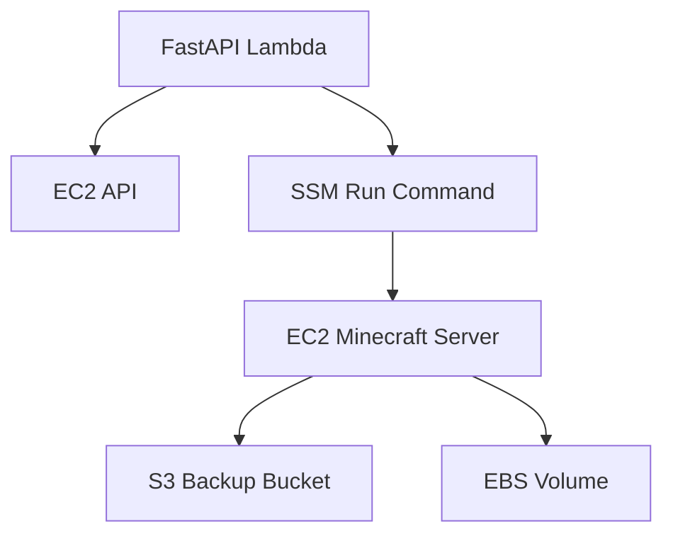

# AWSインフラ設計

## MVP構成



## 作成するAWSリソース

MVPでTerraform管理する対象:

- S3 bucket
- EC2 instance
- EBS root volume
- Security Group
- EC2 IAM Role
- EC2 Instance Profile
- Lambda Function
- Lambda Function URL
- Lambda IAM Role
- Vercel OIDC用IAM Role
- Lambda Function URL resource policy

## EC2

Minecraft Forge Serverを稼働させる。

### 推奨初期instance type

- `t3.small` から開始
- Forge modが重い場合は `t3.medium` へ変更

### ディスク

- MVPではroot volumeに `/opt/minecraft` を配置する
- 初期サイズは20〜30GB程度
- ワールドサイズが増える場合は拡張する

### ディレクトリ例

```text
/opt/minecraft/
  forge-server.jar
  libraries/
  mods/
  config/
  world/
  server.properties
  eula.txt
  scripts/
    backup-and-stop.sh
    backup.sh
    check-idle.sh
```

## systemd

Forge serverをsystemd serviceとして管理する。

```ini
[Unit]
Description=Minecraft Forge Server
After=network.target

[Service]
WorkingDirectory=/opt/minecraft
User=minecraft
Group=minecraft
ExecStart=/usr/bin/java -Xms1G -Xmx3G -jar forge-server.jar nogui
Restart=on-failure

[Install]
WantedBy=multi-user.target
```

## Security Group

### Inbound

| Port | Protocol | Source | Purpose |
|---:|---|---|---|
| 25565 | TCP | 0.0.0.0/0 | Minecraft接続 |
| 22 | TCP | 原則なし | SSHは常時開けない |
| 25575 | TCP | 開けない | RCONは外部公開しない |

### Outbound

- 原則all allow
- S3、SSM、AWS APIへ通信できる必要がある

## S3

停止時バックアップの保存先。

```text
s3://mcsm-world-backups/
  servers/
    vanilla-1/
      vanilla-1-20260505T120000Z.tar.gz
```

MVPでは停止時バックアップのみ。v1で起動中30分ごとの定期バックアップを追加する。

## Lambda

FastAPIをMangum経由でLambda上で実行する。

```python
from mangum import Mangum

handler = Mangum(app)
```

Function URLを作成し、AuthTypeは `AWS_IAM` にする。

## Terraform構成案

最初はmodule分割しすぎない。

```text
terraform/
  main.tf
  variables.tf
  outputs.tf
  iam.tf
  lambda.tf
  ec2.tf
  security_group.tf
  s3.tf
```

慣れてきたらmodule化する。

```text
terraform/
  environments/
    prod/
  modules/
    minecraft_server/
    mcsm_backend/
    backup_bucket/
```

## コスト方針

月額0〜1000円を目標にするため、以下は避ける。

- NAT Gateway
- RDS
- ALB
- ECS/Fargate常時稼働
- Elastic IP常時保持
- 無制限のS3バックアップ保持

固定IPは使わず、起動時に割り当てられるPublic IPをMCSM上に表示する。
