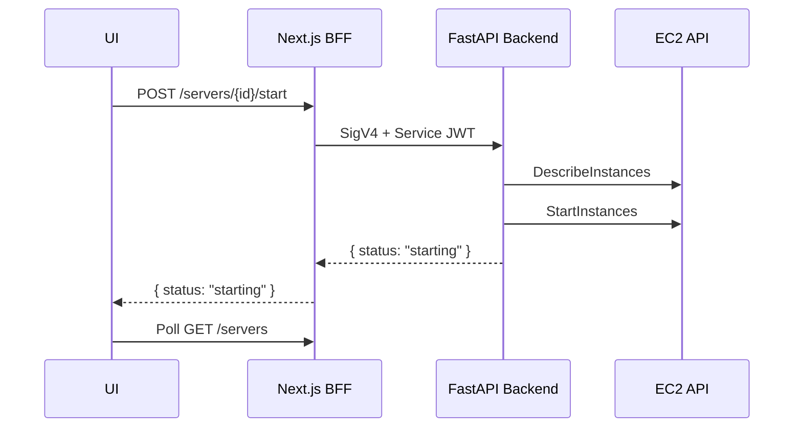
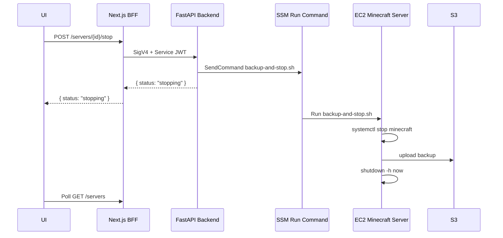

# 起動・停止・バックアップ・自動停止

## 起動処理



## 停止処理

MVPでは非同期停止にする。



## backup-and-stop.sh

MVPで使う停止スクリプト例。

```bash
#!/usr/bin/env bash
set -euo pipefail

SERVER_ID="vanilla-1"
SERVER_DIR="/opt/minecraft"
BACKUP_BUCKET="s3://mcsm-world-backups"
TIMESTAMP="$(date -u +%Y%m%dT%H%M%SZ)"
BACKUP_FILE="/tmp/${SERVER_ID}-${TIMESTAMP}.tar.gz"

sudo systemctl stop minecraft

tar -czf "$BACKUP_FILE" \
  -C "$SERVER_DIR" \
  world mods config server.properties

aws s3 cp "$BACKUP_FILE" \
  "${BACKUP_BUCKET}/servers/${SERVER_ID}/${SERVER_ID}-${TIMESTAMP}.tar.gz"

rm -f "$BACKUP_FILE"

sudo shutdown -h now
```

Forgeでは `world` だけでなく `mods` と `config` もバックアップ対象に含めると復元しやすい。

## 起動中定期バックアップ

MVPでは実装しない。v1で以下を追加する。

```cron
*/30 * * * * /opt/minecraft/scripts/backup.sh
```

## backup.sh

```bash
#!/usr/bin/env bash
set -euo pipefail

SERVER_ID="vanilla-1"
SERVER_DIR="/opt/minecraft"
BACKUP_BUCKET="s3://mcsm-world-backups"
TIMESTAMP="$(date -u +%Y%m%dT%H%M%SZ)"
BACKUP_FILE="/tmp/${SERVER_ID}-${TIMESTAMP}.tar.gz"

# 必要であればRCONでsave-allを実行する
# rcon-cli save-all

tar -czf "$BACKUP_FILE" \
  -C "$SERVER_DIR" \
  world mods config server.properties

aws s3 cp "$BACKUP_FILE" \
  "${BACKUP_BUCKET}/servers/${SERVER_ID}/${SERVER_ID}-${TIMESTAMP}.tar.gz"

rm -f "$BACKUP_FILE"
```

## 自動停止

MVP後にEC2内cronで追加する。MCSM側に自動停止中状態を表示する必要はない。

```text
EC2 cron
  -> check-idle.sh
  -> プレイヤー数取得
  -> 0人が一定時間続いたら backup-and-stop.sh
```

### idle状態

DBではなくEC2内ファイルで管理する。

```text
/var/lib/mcsm/idle_since
```

### 疑似ロジック

```bash
if player_count == 0:
  if idle_since does not exist:
    write current timestamp
  else:
    if now - idle_since > 30min:
      run backup-and-stop.sh
else:
  remove idle_since
```

## プレイヤー数取得

候補:

1. RCONの `list`
2. Minecraft Server Query

MVP後の自動停止ではRCON利用が実装しやすい。ただし、RCONポートは外部公開しない。
